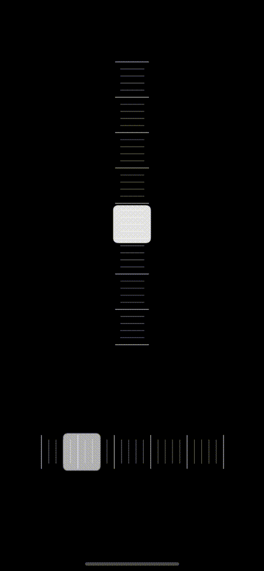

# GraduatedSlider

A UISlider-like control with graduations (e.g. like sliders on DJ decks), can be used vertically or horizontally, optional haptic feedback

[![Swift Version][swift-image]][swift-url]
[![Build Status][travis-image]][travis-url]
[![License][license-image]][license-url]
[](http://makeapullrequest.com)


<p align="center">

</p>

## Features

* IBInspectable
* Customizable graduations and cursor colors
* Customizable range
* Optional haptic feeback
* Horizonal or vertical


## Usage

```swift
let slider = GraduatedSlider()
slider.minimumValue = 0
slider.maximumValue = 100

slider.addTarget(self, action: #selector(onValueChanged(_:)), for: .valueChanged) 
slider.addTarget(self, action: #selector(onSliderTouchEnded(_:)), for: . touchUpInside)
```

### Vertical / horizontal orientation

```swift
slider.isHoritontal = true // default false
```


## Requirements

- iOS 10.0+
- Xcode 10

## Installation


### Swift Package Manager:

```swift
dependencies: [
    .package(url: "https://github.com/sardon/GraduatedSlider", from: "1.0.0")
]
```

## Meta

[Camera1](https://www.camera1.app/)


[https://github.com/sardon/GraduatedSlider](https://github.com/sardon/GraduatedSlider)


[swift-image]:https://img.shields.io/badge/swift-5.0-orange.svg
[swift-url]: https://swift.org/
[license-image]: https://img.shields.io/badge/License-MIT-blue.svg
[license-url]: LICENSE.txt
[travis-image]: https://img.shields.io/travis/dbader/node-datadog-metrics/master.svg?style=flat-square
[travis-url]: https://travis-ci.org/dbader/node-datadog-metrics
